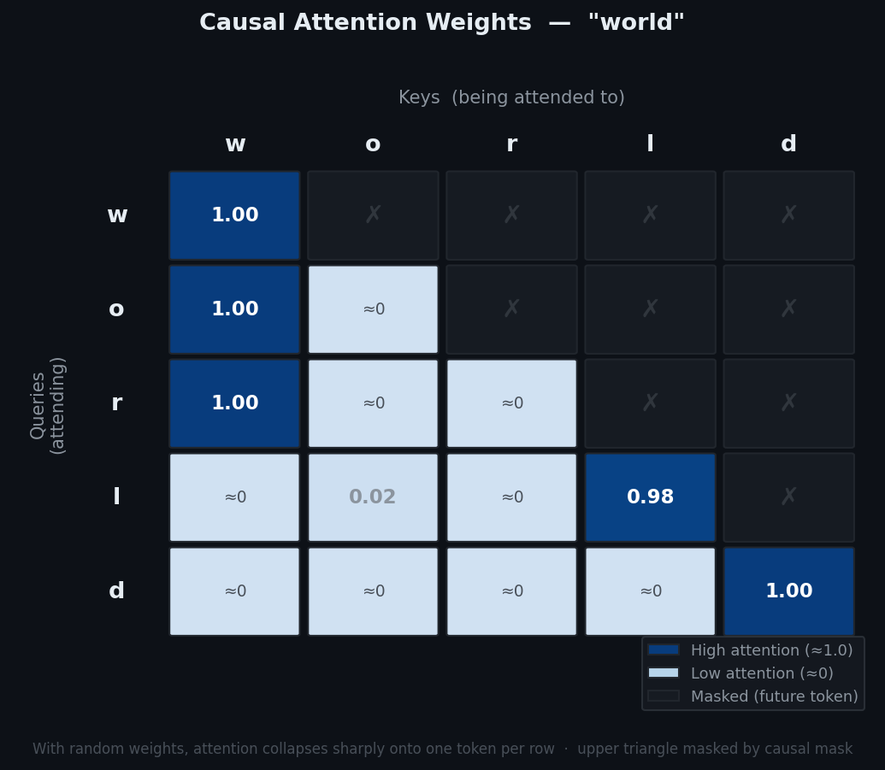

# Mini-GPT: Built from Scratch

I am a Product Manager. I built this because I was making decisions about context windows, hallucination, cost, and latency without truly understanding what drives any of them. Reading about LLMs was not enough. The only way to develop real intuition was to build one.

Not a ChatGPT wrapper. Not prompts embedded on top of a base model. Not fine-tuning. An actual model, from tokens to attention to transformers to decoding, built in PyTorch.

This is a record of what I built, what decisions I made, how the model evolved, and what surprised me along the way.

---

## What I Built

tokens → attention → transformer blocks → decoding → deployed Streamlit app comparing Mini-GPT vs ChatGPT on the same prompt

```
mini-gpt/
├── tokenizer.py           # Days 1–3: tokenization, embeddings, manual attention
├── day4_transformer.py    # Day 4: transformer block
├── mini_gpt.py            # Days 5–6: full architecture and training
├── day7_generation.py     # Day 7: positional encoding, causal masking, decoding
├── training_corpus.txt    # text the model was trained on
├── mini_gpt_checkpoint.pth
└── README.md
```

---

## Days 1–3: Tokenization, Embeddings, Attention

### Tokenization

Before a model sees any text, every word or character gets converted into a number. That is all a tokenizer does. I built one from scratch; one number per unique character.

```python
chars = sorted(list(set(text)))
stoi = {ch: i for i, ch in enumerate(chars)}
itos = {i: ch for i, ch in stoi.items()}
```

The model never sees raw text again after this step. Everything from here is numbers.

**Decision:** I used character-level tokenization rather than the more advanced subword approach (called BPE) that real GPT models use. This kept the vocabulary tiny, around 30 to 100 characters, and made every step visible while learning. Real GPT models have vocabularies of 50,000+ tokens because larger units carry more meaning per token and are more efficient.

**PM Insight:** Every token in a prompt costs money to process. Attention computation grows as the square of token count; doubling the number of tokens quadruples the work. This is why long system prompts and multi-turn conversation histories make LLM products expensive at scale. Token count is a cost decision, not just a technical one.

---

### Embeddings

A number alone tells the model nothing about meaning. Embeddings convert each token number into a list of 64 numbers (a vector) that the model can actually learn from. These vectors start random and get refined during training until related words end up close together in this 64-dimensional space.

```python
embedding = nn.Embedding(vocab_size, embed_dim)  # embed_dim = 64
```

**Decision:** 64 dimensions as a starting point. Small enough to debug, large enough to hold meaningful patterns. Real models use 768 (GPT-2) to 12,288 (GPT-3) dimensions.

**What surprised me:** The 64 numbers in each token's vector are not human-interpretable labels. You cannot look at dimension 12 and call it "positivity." Meaning lives in the relationships between vectors, not in individual numbers. A famous example from embedding research: if you take the vector for "king", subtract "man", and add "woman", the result lands closest to "queen." The model learned that relationship purely from seeing patterns in text, with no human labeling.

---

### Manual Attention

I implemented attention from scratch before using any PyTorch shortcuts; I wanted to understand the mechanism before abstracting it away.

```python
Q = embedded @ W_Q
K = embedded @ W_K
V = embedded @ W_V

scores = Q @ K.T
scaled_scores = scores / torch.sqrt(torch.tensor(embed_dim, dtype=torch.float32))

mask = torch.tril(torch.ones(T, T))
scaled_scores = scaled_scores.masked_fill(mask == 0, float('-inf'))

attention_weights = F.softmax(scaled_scores, dim=-1)
output = attention_weights @ V
```

Attention is how every token learns from every other token. Each token asks three questions of itself: what am I looking for (Query), what do I contain (Key), and what will I share if selected (Value). The model computes how relevant each token is to every other token, then each token absorbs information from the others proportional to that relevance.

By the time the model predicts the next word, each token already contains context from all previous tokens rather than existing in isolation.

The causal mask prevents tokens from looking ahead at future words during training, forcing the model to genuinely learn next-word prediction.

**PM Insight:** When attention focuses on the wrong tokens, the output gets built on faulty context. This is one reason hallucination happens. But it is not the only reason. The training data itself may have been wrong. The model may never have seen the concept and is extrapolating. Or the final sampling step may just pick an unlikely word. Hallucination is not one problem with one fix.


---

## Day 4: Transformer Block

I moved from raw attention code to a proper reusable transformer block using PyTorch.

```python
class MiniTransformerBlock(nn.Module):
    def __init__(self, embed_dim):
        self.attention = nn.MultiheadAttention(embed_dim=embed_dim, num_heads=2, batch_first=True)
        self.norm1 = nn.LayerNorm(embed_dim)
        self.ff = nn.Sequential(
            nn.Linear(embed_dim, embed_dim * 4),
            nn.ReLU(),
            nn.Linear(embed_dim * 4, embed_dim)
        )
        self.norm2 = nn.LayerNorm(embed_dim)

    def forward(self, x):
        attn_output, _ = self.attention(x, x, x)
        x = self.norm1(x + attn_output)
        ff_output = self.ff(x)
        x = self.norm2(x + ff_output)
        return x
```

**Why each piece exists:**

Multi-head attention runs several attention operations in parallel. Each one can pick up on a different kind of relationship in the text. One might track which words refer to the same thing; another might track sentence structure. The model figures out what each head specialises in through training, not through any explicit instruction.

The residual connection, the `x + attn_output` part, adds the original token representation back after every transformation. Each layer builds on previous information rather than replacing it, which keeps deep networks stable during training.

The feedforward step takes each token independently through an expand and compress operation, with a ReLU in the middle. ReLU does one thing: if a value is negative, make it zero. But this tiny non-linearity is what lets the model learn nuance that pure matrix multiplication cannot. Even in a small model, I could see how it helps capture tone, sarcasm, and context that no hardcoded rule could define.

LayerNorm keeps values numerically stable as they pass through many layers.

**Decision:** Used `embed_dim = 16` in this file so tensor shapes stayed readable during debugging. Scaled back to 64 in the full model. Started with 2 attention heads; enough to see multi-perspective behavior without too much complexity.

**What I confirmed:** The shape of the data, batch size by sequence length by embedding dimensions, stays identical throughout the entire block. The transformer does not change the structure; it changes what is inside each position.

---

## Days 5–6: Full Architecture and Training

The final addition was an output layer that maps each token's learned representation to a probability over every word in the vocabulary. Whichever word gets the highest probability is the model's next word prediction.

```python
logits = nn.Linear(embed_dim, vocab_size)(x)
probs = F.softmax(logits, dim=-1)
```

For training, the input is every word in a sentence except the last. The target is every word shifted one position forward. So the model simultaneously learns to predict word 2 from word 1, word 3 from words 1 and 2, and so on.

**Training loss over 180 steps:**
```
Step 0   | Loss: 2.3968
Step 60  | Loss: 1.0150
Step 180 | Loss: 0.7343
```

Loss measures how wrong the model was. The model was genuinely learning. Large drops early as it moves away from random guessing; smaller drops later as it tackles harder patterns.

**Known gaps at this stage:** There was no split between training data and held-out validation data, so there was no way to detect if the model was just memorising examples. Causal masking had been implemented manually in Days 1–3 but was not yet connected to this full model. Both were fixed in Day 7.

**PM Insight:** Data quality shapes everything. A model trained on two sentences learns almost nothing useful. The observation that data quality often matters more than model size is now a foundational idea in AI strategy discussions.

---

## Day 7: Positional Encoding, Causal Masking, Generation, Decoding

This is where the model became a proper GPT-style system.

### Positional Embeddings

Attention alone does not understand word order. Without positional information, "dog bites man" and "man bites dog" would look nearly identical to the model. Positional embeddings fix this by adding a position-specific signal to each token before any attention happens.

```python
self.position_embedding = nn.Embedding(block_size, embed_dim)
x = token_embeddings + self.position_embedding(positions)
```

I used learned positional embeddings, meaning the model learns what each position should add to a token, rather than using a fixed mathematical formula. The model was built for sequences of up to 64 tokens. That limit is baked into the architecture, not adjustable at runtime.

**Decision:** Learned positional embeddings over the original sinusoidal approach from the Attention Is All You Need paper. Simpler to implement, trains alongside everything else.
---

### Causal Masking Properly Connected

In Days 1–3, causal masking was a manual step applied to raw scores. Here it is embedded inside every transformer block and applied automatically for any sequence length.

The mask ensures that when processing token at position 5, the model can only see tokens at positions 1 through 5. It is blind to positions 6 onwards. This is what allows the model to generate text one word at a time; it has genuinely learned to predict the next word without ever having seen it during training.

---

### Architecture Upgrades

| Parameter | Days 5–6 | Day 7 | GPT-2 Small |
|---|---|---|---|
| Embedding dimensions | 16 | 64 | 768 |
| Attention heads | 2 | 4 | 12 |
| Transformer blocks | 2 | 4 | 12 |
| Context window | not fixed | 64 tokens | 1024 tokens |
| Dropout | none | 10% | yes |
| Validation split | no | 80% train; 20% held-out | yes |

Random batch sampling was introduced here. Instead of feeding training data sequentially, 16 random starting positions are picked each step. This stops the model from memorising the exact order of sentences.

The validation split means every 200 steps, the model is tested on text it has never trained on. If training loss keeps falling but held-out loss stops improving, the model is memorising rather than learning general patterns.

Training loss fell to near zero. Validation loss climbed to 12.7. The model memorised the training text rather than learning from it; a direct consequence of training on a small corpus.

---

### Autoregressive Generation with Temperature and Top-K

```python
for _ in range(max_new_tokens):
    x_cond = x[:, -block_size:]
    logits = model(x_cond)[:, -1, :]
    logits = logits / temperature
    values, indices = torch.topk(logits, top_k)
    probs = F.softmax(values, dim=-1)
    next_token = indices.gather(-1, torch.multinomial(probs, 1))
    x = torch.cat([x, next_token], dim=1)
```

Generation works autoregressively: the model looks at previously generated tokens, predicts the next one, appends it, and repeats.

Only the last 64 tokens are visible during generation. Anything older falls outside the model's context window.

**Decision: temperature 0.8, top-k 20**

Always picking the most probable next word makes output repetitive. Sampling from the full vocabulary makes it incoherent.

Top-k sampling restricts generation to the 20 most likely candidates, while temperature controls randomness. Together, they produced coherent but non-repetitive output.

**PM Insight:** The transformer architecture is largely settled. There is only so much to change in the attention and feedforward structure. What fascinated me was the last step. Do you always pick the most probable word? Or do you shortlist the top candidates and pick randomly from them? That decision is where the model's personality lives. A legal AI and a creative writing tool can run on identical architectures. The decoding configuration is what makes them feel different.

---

## The Portability Insight

The entire architecture lives in one file. The training text lives in another. Copy-paste any text into that file, a book, a person's writing, an entire domain, and you have a customised Mini-GPT. The architecture stays the same; the training text changes the behavior.

This made the Streamlit comparison instructive. Mini-GPT was trained on a small set of personal writing. Ask it anything and it answers with remixes of that text, grammatically structured but contextually wrong. The gap between Mini-GPT and ChatGPT on the same prompt is a live demonstration of what training data actually does to a model.

**PM Insight:** Hallucination is not a prompt engineering problem. The model optimises for what word is statistically most likely next, not for what is true. When a prompt falls outside what the model has seen in training, it still generates a confident, fluent response, because that is exactly what it was built to do. Grounding through retrieval, citation requirements, or constrained generation are architectural fixes. Prompt engineering works at the margins.

---

## What I Know I Don't Know Yet

- Nucleus sampling, which is a more sophisticated version of top-k that I have not implemented
- The internals of PyTorch's built-in MultiheadAttention versus the manual version I built in Days 1–3
- How to study what individual attention heads have specialised in, which is an active research area called mechanistic interpretability
- RLHF, which is how raw GPT becomes a helpful assistant. I understand the concept but have not implemented it
- How techniques like quantization and speculative decoding reduce inference cost without retraining the model

---

## How to Run

```bash
python3 -m venv venv && source venv/bin/activate
pip install torch

python3 tokenizer.py          # Days 1–3
python3 day4_transformer.py   # Day 4
python3 mini_gpt.py           # Days 5–6
python3 day7_generation.py    # Day 7; trains then opens interactive generation
```
